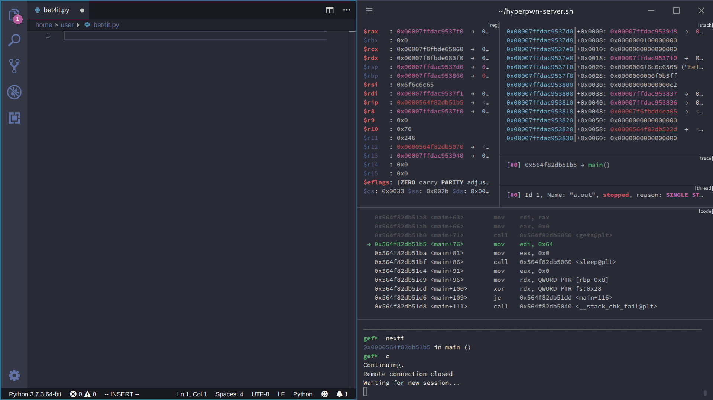
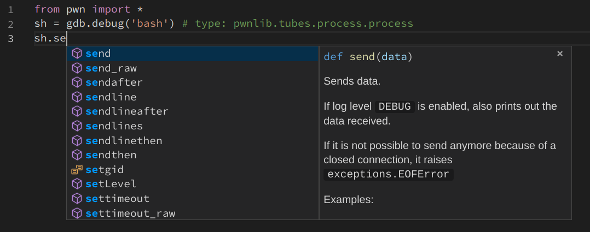
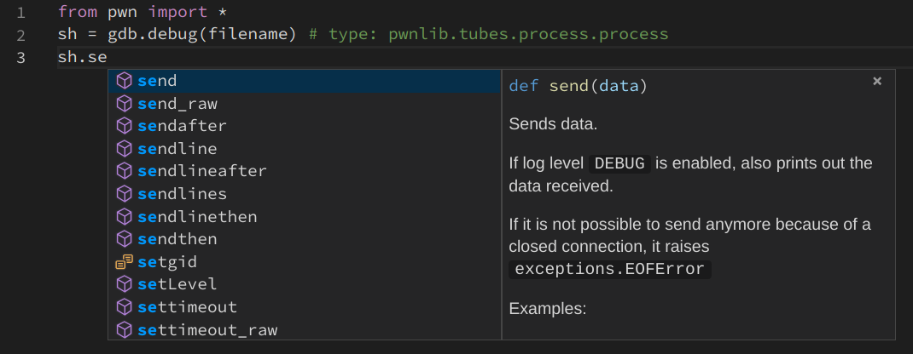
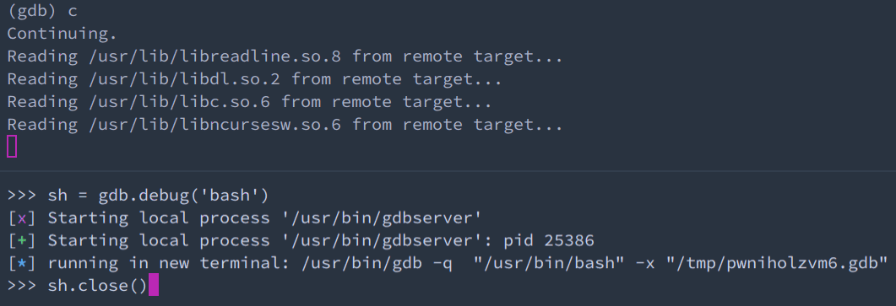

# Build an efficient pwn development environment in 2019



It has been years that, every time I determined to start learning pwn, I found that I can't write the exploits or debug the executable efficiently.

I finally decided to do something to change this situation.

So I spent some time on the usage of related tools.
I even developed some scripts and tools to help me with a better experience.

Now you could have a more efficient pwn development environment in the year of 2019.

You can have a glimpse of the final environment in the GIF above.

In this article, I will show you how to build this environment.

## Arch Linux

If you want to pwn an `ELF`, firstly you need a Linux distribution.

I use [Arch Linux](https://www.archlinux.org/), which owns a powerful [AUR](https://aur.archlinux.org/) to install different kinds of softwares, and all the following parts are based on it.

If you use other Linux distribution or even macOS, you may need to find ways to install some packages on your computer. But configurations below should still be useful for you.

Or you can just switch to [Arch Linux](https://www.archlinux.org/), or [Manjaro](https://manjaro.org/) if you don't want to install a Linux distribution by command line.

You may find many articles still teach you to use `yaourt` to install packages in `AUR`, but it has [discontinued](https://github.com/archlinuxfr/yaourt/issues/382#issuecomment-437461631) and is not suggested to use.

It's better to choose another [AUR helper](https://wiki.archlinux.org/index.php/AUR_helpers), and my suggestion is [Yay](https://github.com/Jguer/yay).
You can install it by ways listed [here](https://github.com/Jguer/yay#installation).

## glibc

`glibc` is the most important library in Linux, and when debugging we usually need to refer to some symbols in `glibc`, such as `main_arena`.

`Arch Linux` doesn't provide us with `glibc` symbols. If we need to add symbols to `glibc`, we must edit its `PKGBUILD` and add `debug` to `options` and package it by ourselves:

```sh
yay -G glibc
cd glibc
sed -i 's/options=(!strip staticlibs)/options=(!strip debug staticlibs)/' PKGBUILD
makepkg -si
```

Notice: this step could not be necessary if you want to use the `glibc` same as which used on the server.
In this situation, you may need to check the [virtual environment section](https://github.com/bet4it/pwn-environment#virtual-environment) to solve it.

## GDB

The most important tool when debugging is [GDB](https://www.gnu.org/software/gdb/).
(Certainly, you can use [LLDB](https://lldb.llvm.org/) if you like)

You can install it by

```
pacman -S gdb
```

and if you need to debug ELF in other architectures rather than i386/x86\_64, you need to install `gdb-multiarch` from `AUR`:

```
yay -S gdb-multiarch
```

But `GDB` itself is hard to use, you need some plugins to enhance `GDB`.

You may have heard of [peda](https://github.com/longld/peda), but today we have better choices like [GEF](https://github.com/hugsy/gef) and [pwndbg](https://github.com/pwndbg/pwndbg), which are more powerful and in active development.

You can install them by
```
yay -S gef-git
```
or
```
yay -S pwndbg-git
```
and add `source /usr/share/gef/gef.py` or `source /usr/share/pwndbg/gdbinit.py` in `~/.gdbinit` to use them.

## hyperpwn

Although `GEF` and `pwndbg` can help us a lot when debugging, they simply print all the `context` outputs to terminal and don't organize them in a layout like what have done in `ollydbg` and `x64dbg`.

You may have heard of [Voltron](https://github.com/snare/voltron) or [gdb-dashboard](https://github.com/cyrus-and/gdb-dashboard) to help this, and they can be used together with `GEF` or `pwndbg`. But that means you must disable the `context` function in `GEF` or `pwndbg`, which may lose some features provided by them, and although we can use some ways to [automate the layout creation](https://github.com/snare/voltron/wiki/Layout-automation), it still needs manual intervention.

One major drawback of tools above is that we can't easily check for previous states, which is very useful when debugging.
We need to scroll the terminal again and again and lost in huge amounts of outputs, or previous outputs may have been cleared.

Certainly, we can use [reverse debugging in GDB](https://www.gnu.org/software/gdb/news/reversible.html) or [rr](https://rr-project.org/) to help us, but most time we only need to have a peek of the previous state.

Some people tried to solve this problem before like [this](https://www.youtube.com/watch?v=EU8uooZYvpE), but it was only a prototype.

I have developed a new tool named [hyperpwn](https://github.com/bet4it/hyperpwn/) to solve all the problems mentioned before.

`hyperpwn` bases on [Hyper](https://hyper.is/) terminal, you can install it by
```
pacman -S hyper
```
then follow the steps [here](https://github.com/bet4it/hyperpwn#install) to install `hyperpwn`.

After `hyperpwn` is installed correctly, if you run `gdb` in `Hyper` terminal and `GEF` or `pwndbg` is loaded, a layout will be created automatically.

## pwntools

The most widely used library to facilitate creating pwn script is [pwntools](http://pwntools.com).

But `pwntools` lacks support for `Python 3` before, and `Python 2.7` [will not be maintained past 2020](https://www.python.org/dev/peps/pep-0373/).

Thanks to [Arusekk](https://github.com/Arusekk), currently `pwntools` supports `Python 3` in [dev3 branch](https://github.com/Gallopsled/pwntools/tree/dev3).

We can install it easily from `AUR`:
```
yay -S python-pwntools-git
```

## VS Code

We need a handy editor to help us write pwn scripts.
I suggest using [Visual Studio Code](https://code.visualstudio.com/), which is lightweight, out-of-the-box and powerful.

You can install the open source build version of VS Code by
```
pacman -S code
```

or install the official binary version by
```
yay -S visual-studio-code-bin
```

Then you just need to install the [python plugin](https://marketplace.visualstudio.com/items?itemName=ms-python.python), and you can start to write pwn scripts.

### Settings

There are some settings needed to tweak to improve the experience.
You can find config file including all the settings below in [settings.json](settings.json).

#### Code completion

`VS Code` uses [Jedi](http://jedi.readthedocs.io) to do code completions.
But you may find that the following code can't be completed:



Because `Jedi` can't detect the type of `sh` correctly.

We can add a [type hinting](https://jedi.readthedocs.io/en/latest/docs/features.html#type-hinting) to help `Jedi` with this:



It seems that [Microsoft Python Language Server](https://github.com/Microsoft/python-language-server) can't recognize this kind of type hinting, so if you want to have completions in such situation, make sure `python.jediEnabled` is set to `true`.

#### Integrated terminal

VS Code provides us with an integrated terminal.
So when you finish your script, you don't need to leave VS Code to run it.

You can just right click in the pwn script and select `Run Python File in Terminal`, and the file will be executed in VS Code's integrated terminal.

You can also select `Run Selection/Line in Python Terminal` to send parts of your script to `REPL`, which will help you a lot when writing script.

As most pwn scripts are written in a single file, and may use a relative path like `gdb.debug('./a.out')`, it's better to let the script run in file's directory by setting `python.terminal.executeInFileDir` to `true`.
(However, this option currently [doesn't affect `Run Selection/Line in Python Terminal`](https://github.com/microsoft/vscode-python/issues/6632))

You can replace the default `Python REPL` with `IPython` to get a more powerful interactive REPL, by setting `python.terminal.launchArgs` to `["-m", "IPython", "--no-autoindent"]`.

In order to use `Ctrl+P` in terminal to select commands executed previously, you need to set `terminal.integrated.commandsToSkipShell` with `["-workbench.action.quickOpen"]`.

#### Code runner

It's a pity that `Run Python File in Terminal` and `Run Selection/Line in Python Terminal` [can't be used consecutively](https://github.com/microsoft/vscode-python/issues/2997). As `Run Selection/Line in Python Terminal` can't be replaced easily, we can replace the `Run Python File in Terminal` function with the [Code Runner plugin](https://marketplace.visualstudio.com/items?itemName=formulahendry.code-runner).

Like what has been mentioned before, we need to set `code-runner.fileDirectoryAsCwd` to `true`, so the relative path to executable can be parsed correctly.

Many pwn scripts use the `interactive` function to interact with the shell, so we need to set `code-runner.runInTerminal` to `true`.

### Shortcuts

There are some shortcuts which are very useful when we write pwn scripts:

| Command                                 | Keybinding    |
|-----------------------------------------|---------------|
| Toggle Line comment                     | Ctrl + /      |
| Focus into Python Script                | Ctrl + 1      |
| Toggle / Focus into Integrated Terminal | Ctrl + `      |
| Run Selection/Line in Python Terminal   | Shift + Enter |

Full keyboard shortcuts of VS Code can be found [here](https://code.visualstudio.com/shortcuts/keyboard-shortcuts-linux.pdf) or just press <kbd>Ctrl+K Ctrl+S</kbd> in VS Code.

You can also install the [Vim plugin](https://marketplace.visualstudio.com/items?itemName=vscodevim.vim) if you are familar with `vim` key bindings.

## Cooperation

Now we have all parts needed to build a pwn environment. How can we combine them together so we can get an efficient pwn environment?

The key part is the cooperation of `pwntools` and `hyperpwn`.
We need `pwntools` when we write pwn scripts and `hyperpwn` to debug the executable.

`pwntools` provides `gdb.debug` function to create a debug session by a script file.
It will start `gdbserver` with the executable to be debugged in the background and run `gdb` in a new terminal to connect the `gdbserver`.

We can control which terminal will be chosen by setting `context.terminal`, e.g., `['konsole', '-e']`.
However, `Hyper` terminal, which `hyperpwn` replies on, [doesn't provide similar arguments](https://github.com/zeit/hyper/issues/3141).

And even `Hyper` provides this, it mostly means that we need to start a new `Hyper` terminal every time we run `gdb.debug`, we can't specify to run `gdb` in an existed terminal.

To solve this problem, I created two simple scripts, one acts as a server and the other one acts as a client.
They communicate with named pipe.

Server side script [hyperpwn-server.sh](hyperpwn-server.sh) which should be used in `Hyper` terminal:
```sh
#!/bin/sh
pipe=/tmp/hyperpwn-pipe; if [[ ! -p $pipe ]]; then mkfifo $pipe; fi; while read line < $pipe; do sh -c "$line"; echo "Waiting for new session..."; done
```

Client side script [hyperpwn-client.sh](hyperpwn-client.sh) which should be set as `context.terminal`:
```sh
#!/bin/sh
echo "cd $PWD; $1" > /tmp/hyperpwn-pipe
```

After `gdb` connected to `gdbserver`, we may find that even if we use `sh.close()` to shutdown `gdbserver`, `gdb` will remain there, which prevents the next session:



I created a gdb python script [autoquit.py](autoquit.py) to quit `gdb` when the connection is closed:
```python
import gdb
def exec_quit(prompt):
    gdb.execute("quit")

def exit_handler(event):
    gdb.prompt_hook = exec_quit

gdb.events.exited.connect(exit_handler)
```

That's what it looks like after `source` this script in `~/.gdbinit`:


If you only have one monitor, you may want to put the `VS Code` window and the `Hyper` window side by side.

I created a vertical layout of `hyperpwn`, so you can maximize the use of your monitor.
you can overwrite configs in `~/.hyperinator` with them to enable it.

If you use `GEF`, you can replace `~/.hyperinator/hyperpwn-gef.yaml` with [hyperpwn-gef-v.yaml](hyperpwn-gef-v.yaml):
```yaml
session_name: gef
global_options:
  default-shell: /bin/sleep
  default-shell-args: infinity
windows:
- layout: 34da,70x51,0,0[70x25,0,0{28x25,0,0,1,41x25,29,0[41x14,29,0,2,41x7,29,15,3,41x2,29,23,4]},70x14,0,26,5,70x10,0,41,6]
  panes:
  - shell_command:
    - hyperpwn trace
  - shell_command:
    - hyperpwn stack
  - shell_command:
    -
    reuse: True
    focus: True
  - shell_command:
    - hyperpwn thread
  - shell_command:
    - hyperpwn code
  - shell_command:
    - hyperpwn reg
```

If you use `pwndbg`, you can replace `~/.hyperinator/hyperpwn-pwndbg.yaml` with [hyperpwn-pwndbg-v.yaml](hyperpwn-pwndbg-v.yaml):
```yaml
session_name: pwndbg
global_options:
  default-shell: /bin/sleep
  default-shell-args: infinity
windows:
- layout: 5d07,70x52,0,0[70x24,0,0{32x24,0,0,1,37x24,33,0[37x15,33,0,2,37x5,33,16,3,37x2,33,22,4]},70x15,0,25,5,70x11,0,41,6]
  panes:
  - shell_command:
    - hyperpwn TRACE
  - shell_command:
    - hyperpwn STACK
  - shell_command:
    -
    reuse: True
    focus: True
  - shell_command:
    - hyperpwn LEGEND
  - shell_command:
    - hyperpwn DISASM
  - shell_command:
    - hyperpwn REG
```

I have created a python snippet, so you can create a pwn script template with some tips mentioned before by just typing `pwn`.

You can use it by select `File - Perference - User Snippets - Python` and paste this [python.json](python.json) file there, and you can change it as you like:
```json
{
	"pwn": {
		"prefix": "pwn",
		"body": [
			"from pwn import *",
			"",
			"try:",
			"\tsh.close()",
			"except:",
			"\tpass",
			"",
			"context.arch = 'amd64'",
			"context.terminal = ['./hyperpwn-client.sh']",
			"",
			"filename = '${1:./a.out}'",
			"",
			"elf = ELF(filename)",
			"libc = elf.libc",
			"",
			"sh = gdb.debug(filename) # type: pwnlib.tubes.process.process",
			"# sh = process(filename)",
			"# sh = remote('127.0.0.1', 7777)",
			""
		],
		"description": "pwn script template"
	}
}
```

## Virtual environment

One big drawback of our environment is that most pwn executables are running on `Ubuntu`, and the version of `glibc` is different from our environment.

Virtual environment can help us with this situation.
It can provide us a `Ubuntu` environment with a low cost.

we can create a virtual environment by [debootstrap](https://tracker.debian.org/pkg/debootstrap), [Docker](https://www.docker.com/) or [Vagrant](https://www.vagrantup.com/).

We could set up a shared directory between host and virtual environment, so we can edit the pwn script file on the host.

After we enter the virtual environment's Pyhon REPL manually in VS Code's integrated terminal, the `Run Selection/Line in Python Terminal` function should also work well.

`hyperpwn` doesn't care about where the `gdb` is running.
If you run `gdb` in a virtual environment on the host's `Hyper terminal` without a wrapper likes `tmux`, or if you use host's `gdb` to connect with `gdbserver` running in the virtual environment, `hyperpwn` should work likes before.

So all the settings before are still meaningful when we migrate to a virtual environment.

## Embedded environment

Sometimes we may need to pwn a real-life program on an embedded device.

But some embedded devices use a minimal Linux environment, which could not provide `gdb` or `gdbserver` for us, and it could be not easy to cross compile them as the source code of `gdb` is so huge.

Certainly, we can use prebuilt statically linked `gdbserver` compiled by others likes [this](https://github.com/hugsy/gdb-static), but if it can't work in your environment it's hard to fix it.

To solve this problem, I developed a tiny `gdbserver` from scratch, you can find it [here](https://github.com/bet4it/gdbserver).

It's very easy to compile it, all you need is a `gcc` that can generate `ELF` for the target environment.

You can connect this tiny `gdbserver` with a normal `gdb` client, and most common commands needed when debugging should work.

You can even load `GEF` or `pwndbg` in `gdb` client, and use `hyperpwn` on it, likes what have been described before.

## Conclusion

In this article, I share some ways I used to build my pwn development environment.

Hope it's useful for you when you build your own environment.

And if you find some other ways and want to share it to others, feel free to send a pull request!

Happy hacking~
